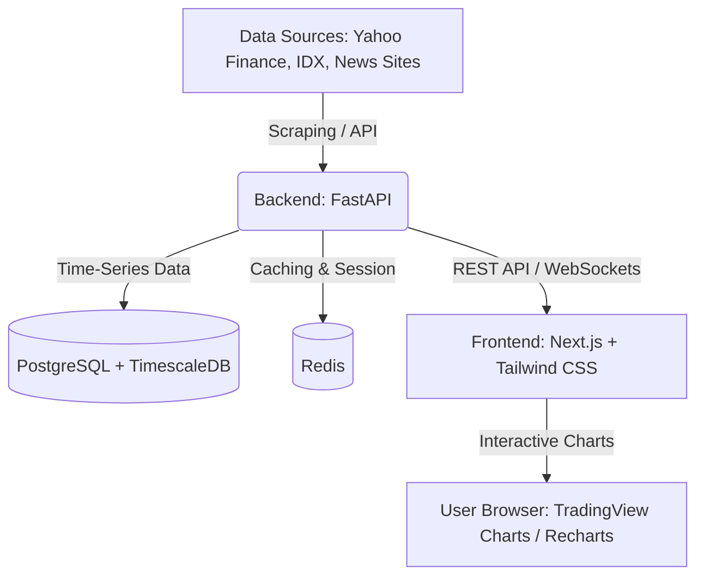

# Stock Village Web Dashboard

Projek ini adalah platform analisis, pemantauan, dan visualisasi Indeks Harga Saham Gabungan (IHSG) secara komprehensif. Aplikasi dirancang menggunakan arsitektur modern fullstack (FastAPI + Next.js) dengan kapabilitas analisis data historis, sentimen berita, pelacakan dana asing (*foreign flow*), dan pencarian saham (*stock screener*).

---

## 1. Arsitektur Sistem & Tech Stack



### **Backend (Data & API)**
*   **Framework:** **FastAPI (Python)** — Dipilih karena sangat cepat, mendukung asinkronus (async), dan ekosistem Python yang kaya akan pustaka analisis keuangan (Pandas, Numpy, TA-Lib).
*   **Database Utama:** **PostgreSQL** (opsional dengan ekstensi **TimescaleDB** untuk penyimpanan data time-series harga saham secara efisien).
*   **Caching & Broker:** **Redis** — Untuk menyimpan data *real-time ticker* IHSG dan mengurangi beban API eksternal.
*   **Scraper / Data Fetcher:** `yfinance` (Yahoo Finance API), `BeautifulSoup4` (untuk scraping berita), dan `pandas-ta` (untuk analisis teknikal otomatis).

### **Frontend (User Interface & Visualisasi)**
*   **Framework:** **Next.js (React)** — Optimal untuk performa, SEO-friendly (penting untuk web berita/informasi saham), dan mendukung Server-Side Rendering (SSR).
*   **Styling:** **Tailwind CSS** + **Shadcn/ui** (untuk komponen UI yang bersih, modern, dan profesional).
*   **Visualisasi Chart:** **TradingView Lightweight Charts** atau **Recharts** — Untuk grafik candlestick dan volume interaktif yang *responsive*.

---

## 2. Struktur Direktori Projek

```text
ihsg-dashboard/
├── backend/
│   ├── app/
│   │   ├── __init__.py
│   │   ├── main.py            # Entry point FastAPI
│   │   ├── config.py          # Konfigurasi database & environment
│   │   ├── database.py        # Koneksi database SQLAlchemy / Tortoise ORM
│   │   ├── models.py          # Definisi skema tabel database
│   │   ├── schemas.py         # Skema Pydantic untuk request & response
│   │   ├── services/
│   │   │   ├── __init__.py
│   │   │   ├── scraper.py     # Service pengambil data IHSG (Yahoo Finance/IDX)
│   │   │   ├── analytics.py   # Penghitungan indikator teknikal (RSI, MACD, MA)
│   │   │   └── news.py        # Scraper berita saham & analisis sentimen
│   │   └── api/
│   │       ├── __init__.py
│   │       ├── endpoints/
│   │       │   ├── ihsg.py    # Endpoint data IHSG & sektoral
│   │       │   ├── stocks.py  # Endpoint saham individual (LQ45, dsb.)
│   │       │   └── news.py    # Endpoint berita & sentimen
│   └── requirements.txt       # Dependensi Python
├── frontend/
│   ├── src/
│   │   ├── app/               # Next.js App Router (pages & layouts)
│   │   ├── components/        # Reusable UI Components (CandlestickChart, Screener, NewsCard)
│   │   ├── hooks/             # Custom React Hooks (useIHSGData, useWebSocket)
│   │   ├── lib/               # Utility functions & API clients
│   │   └── types/             # TypeScript interfaces
│   ├── package.json
│   ├── tailwind.config.js
│   └── tsconfig.json
└── README.md
```

---

## 3. Fitur Utama Aplikasi

1.  **Dashboard IHSG Real-Time & Historis:**
    *   Grafik Candlestick interaktif IHSG (`^JKSE`) harian, mingguan, bulanan.
    *   Status Pasar (Open, High, Low, Close, Volume, Value, Freq).
    *   Performa Indeks Sektoral (Infrastruktur, Keuangan, Energi, Consumer, dll.).
2.  **Analisis Arus Dana Asing (*Foreign Flow*):**
    *   Pelacakan akumulasi/distribusi dana asing (*Net Foreign Buy/Sell*) harian dan akumulatif secara *real-time*.
3.  **Penyaring Saham Pintar (*Stock Screener*):**
    *   Menyaring saham berdasarkan rasio fundamental penting: PE Ratio, PBV, ROE, Dividend Yield, dan Market Cap.
    *   Filter teknikal: Golden Cross MA50/200, RSI Oversold/Overbought.
4.  **Agregasi Berita & Analisis Sentimen (AI/NLP):**
    *   Scraping otomatis berita keuangan Indonesia (CNBC Indonesia, Kontan, Bisnis.com).
    *   Menggunakan model NLP sederhana (VADER atau Transformers lokal) untuk menentukan sentimen berita (*Positive*, *Neutral*, *Negative*) terhadap IHSG.
5.  **Simulasi Portofolio & Alert Sistem:**
    *   Fitur bagi pengguna untuk membuat portofolio virtual dan melacak performa aset mereka dibanding performa IHSG (*beating the market*).

---

## 4. Build Frontend (Vite — Fase 2 tech lead plan)

Pipeline build minimal (tanpa mengubah logika; bundling + minify + asset hash):

```bash
cd frontend
npm install        # sekali
npm run build      # -> frontend/dist/ (index.html + assets/ + js/ tersalin)
```

- **Dev / Termux:** `bash start_all.sh` (serve source langsung, tanpa build).
- **Prod:** `bash start_all.sh` dengan `FRONTEND_DIR=dist` (serve hasil build yang
  lebih kecil & cache-busted), atau layani `frontend/dist/` via nginx/CDN.
- **Catatan arsitektur:** script klasik (`js/lib.js`, `ui.js`, `app.js`) tidak
  di-bundle (butuh `type="module"` yang mengubah scope global) — disalin apa
  adanya. Code-split/minify JS penuh dilakukan bertahap (strangler pattern,
  lihat TECH_LEAD_PLAN.md).

---

## 5. PWA (Progressive Web App — Fase 2)

Aplikasi bisa di-*install* di HP sebagai app standalone + **shell tetap terbuka saat offline**:

- `manifest.webmanifest` — nama, icon (192/512), `display: standalone`, warna tema.
- `sw.js` — service worker:
  - **API tidak pernah di-cache** (data live; status offline ditampilkan jujur "Disconnected").
  - Navigasi: network-first, fallback ke shell saat offline.
  - Aset statis (css/js/icon): cache-first + update di latar.
  - Install fail-fast (precache dibatasi waktu; SW selalu aktif) — pola produksi.
- Ikon: `icons/icon-192.png`, `icons/icon-512.png` (dibuat otomatis).
- Registrasi otomatis di `js/app.js` (saat `window.load` + retry) — di-*serve* tanpa gzip
  (`serve_with_proxy.py` mengecualikan `sw.js` karena engine SW menangani gzip script
  secara inkonsisten).

Verifikasi: manifest valid, SW `activated`, **mode offline memuat shell dari cache**,
kembali online → `Connected`. (Di headless Chromium shell, SW bisa flaky — pakai Chrome
asli / HP untuk uji installability penuh.)

---

## 6. Gating 1-Password (nginx auth_basic)

Untuk pemakaian pribadi/komunitas kecil, seluruh app bisa dilindungi satu password
di level nginx (sebelum TLS, sebelum app):

```bash
# 1) buat file .htpasswd (sekali; user & password bisa diset)
bash infrastructure/api-gateway/generate_htpasswd.sh
#    (opsional: USER=nama PASS=rahasia bash ...)

# 2) aktifkan di compose (default AKTIF) & restart gateway
docker compose up -d --build api-gateway
```

- Password di-*hash* (apr1) — `.htpasswd` tidak di-commit (gitignore).
- **Menonaktifkan:** hapus/komentari 2 baris `auth_basic` di
  `infrastructure/api-gateway/nginx.conf` + baris volume `.htpasswd` di
  `docker-compose.yml`.
- **Catatan:** di mode lokal/Termux (`start_all.sh`, tanpa nginx) gating tidak
  aktif — hanya berlaku saat lewat API Gateway.
